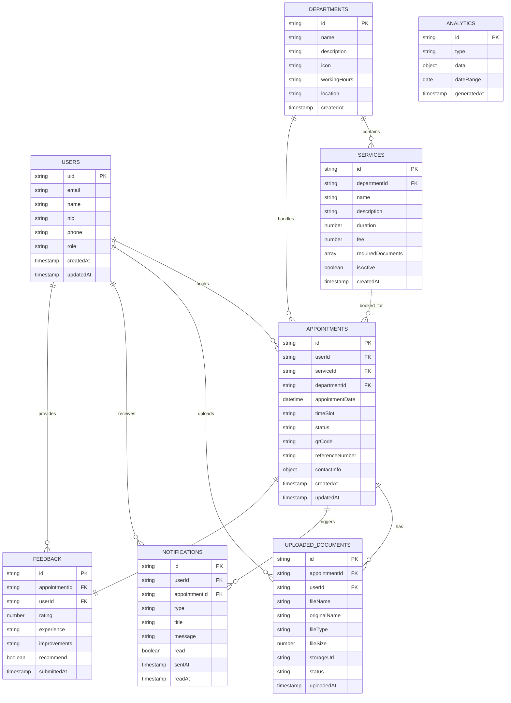

# Database Schema - ER Diagram

## Entity Relationship Diagram



## Database Collections

### 1. Users Collection
Stores user authentication and profile information.

```typescript
interface User {
  uid: string;                    // Firebase Auth UID (Primary Key)
  email: string;                  // User email address
  name: string;                   // Full name
  nic: string;                    // National Identity Card number
  phone: string;                  // Contact phone number
  role: 'citizen' | 'officer' | 'admin';  // User role
  createdAt: Timestamp;           // Account creation timestamp
  updatedAt: Timestamp;           // Last profile update
}
```

### 2. Departments Collection
Government departments offering services.

```typescript
interface Department {
  id: string;                     // Department ID (Primary Key)
  name: string;                   // Department name
  description: string;            // Department description
  icon: string;                   // Icon identifier
  workingHours: string;           // Operating hours (e.g., "9:00-17:00")
  location: string;               // Physical address
  createdAt: Timestamp;           // Creation timestamp
}
```

### 3. Services Collection
Services offered by departments.

```typescript
interface Service {
  id: string;                     // Service ID (Primary Key)
  departmentId: string;           // Foreign Key to Department
  name: string;                   // Service name
  description: string;            // Service description
  duration: number;               // Service duration in minutes
  fee: number;                    // Service fee in LKR
  requiredDocuments: string[];    // List of required documents
  isActive: boolean;              // Service availability status
  createdAt: Timestamp;           // Creation timestamp
}
```

### 4. Appointments Collection
Citizen appointment bookings.

```typescript
interface Appointment {
  id: string;                     // Appointment ID (Primary Key)
  userId: string;                 // Foreign Key to User
  serviceId: string;              // Foreign Key to Service
  departmentId: string;           // Foreign Key to Department
  appointmentDate: Date;          // Appointment date and time
  timeSlot: string;               // Time slot (e.g., "10:00-11:00")
  status: 'pending' | 'confirmed' | 'completed' | 'cancelled';
  qrCode: string;                 // Generated QR code data
  referenceNumber: string;        // Unique reference number
  contactInfo: {                  // Contact information
    name: string;
    email: string;
    phone: string;
  };
  createdAt: Timestamp;           // Booking timestamp
  updatedAt: Timestamp;           // Last status update
}
```

### 5. Uploaded Documents Collection
Documents uploaded by citizens.

```typescript
interface UploadedDocument {
  id: string;                     // Document ID (Primary Key)
  appointmentId: string;          // Foreign Key to Appointment
  userId: string;                 // Foreign Key to User
  fileName: string;               // Generated file name
  originalName: string;           // Original file name
  fileType: string;               // MIME type
  fileSize: number;               // File size in bytes
  storageUrl: string;             // Firebase Storage URL
  status: 'pending' | 'approved' | 'rejected';
  uploadedAt: Timestamp;          // Upload timestamp
}
```

### 6. Notifications Collection
System notifications to users.

```typescript
interface Notification {
  id: string;                     // Notification ID (Primary Key)
  userId: string;                 // Foreign Key to User
  appointmentId?: string;         // Optional Foreign Key to Appointment
  type: 'confirmation' | 'reminder' | 'status_update' | 'document_review';
  title: string;                  // Notification title
  message: string;                // Notification content
  read: boolean;                  // Read status
  sentAt: Timestamp;              // Send timestamp
  readAt?: Timestamp;             // Read timestamp (optional)
}
```

### 7. Feedback Collection
Post-appointment feedback from citizens.

```typescript
interface Feedback {
  id: string;                     // Feedback ID (Primary Key)
  appointmentId: string;          // Foreign Key to Appointment
  userId: string;                 // Foreign Key to User
  rating: number;                 // 1-5 star rating
  experience: string;             // Experience description
  improvements: string;           // Suggested improvements
  recommend: boolean;             // Would recommend service
  submittedAt: Timestamp;         // Submission timestamp
}
```

### 8. Analytics Collection
System analytics and metrics.

```typescript
interface Analytics {
  id: string;                     // Analytics ID (Primary Key)
  type: 'appointments' | 'departments' | 'users' | 'feedback';
  data: Record<string, any>;      // Analytics data object
  dateRange: {                    // Date range for the data
    start: Date;
    end: Date;
  };
  generatedAt: Timestamp;         // Generation timestamp
}
```

## Relationships

### One-to-Many Relationships
- **Users → Appointments**: One user can have multiple appointments
- **Users → Uploaded Documents**: One user can upload multiple documents
- **Users → Notifications**: One user can receive multiple notifications
- **Users → Feedback**: One user can provide multiple feedback entries
- **Departments → Services**: One department can offer multiple services
- **Departments → Appointments**: One department can handle multiple appointments
- **Services → Appointments**: One service can have multiple appointments
- **Appointments → Uploaded Documents**: One appointment can have multiple documents
- **Appointments → Notifications**: One appointment can trigger multiple notifications

### One-to-One Relationships
- **Appointments → Feedback**: One appointment can have one feedback entry

## Indexes

### Firestore Composite Indexes
```javascript
// Appointments by user and status
appointments: {
  fields: [
    { fieldPath: "userId", order: "ASCENDING" },
    { fieldPath: "status", order: "ASCENDING" },
    { fieldPath: "appointmentDate", order: "DESCENDING" }
  ]
}

// Appointments by department and date
appointments: {
  fields: [
    { fieldPath: "departmentId", order: "ASCENDING" },
    { fieldPath: "appointmentDate", order: "ASCENDING" }
  ]
}

// Services by department
services: {
  fields: [
    { fieldPath: "departmentId", order: "ASCENDING" },
    { fieldPath: "isActive", order: "ASCENDING" }
  ]
}

// Notifications by user and read status
notifications: {
  fields: [
    { fieldPath: "userId", order: "ASCENDING" },
    { fieldPath: "read", order: "ASCENDING" },
    { fieldPath: "sentAt", order: "DESCENDING" }
  ]
}
```

## Security Rules

### Firestore Security Rules
```javascript
rules_version = '2';
service cloud.firestore {
  match /databases/{database}/documents {
    // Users can read/write their own data
    match /users/{userId} {
      allow read, write: if request.auth != null && request.auth.uid == userId;
    }
    
    // Departments are readable by all authenticated users
    match /departments/{departmentId} {
      allow read: if request.auth != null;
      allow write: if request.auth != null && get(/databases/$(database)/documents/users/$(request.auth.uid)).data.role == 'admin';
    }
    
    // Services are readable by all authenticated users
    match /services/{serviceId} {
      allow read: if request.auth != null;
      allow write: if request.auth != null && get(/databases/$(database)/documents/users/$(request.auth.uid)).data.role in ['admin', 'officer'];
    }
    
    // Appointments are readable/writable by owner and officers
    match /appointments/{appointmentId} {
      allow read, write: if request.auth != null && 
        (resource.data.userId == request.auth.uid || 
         get(/databases/$(database)/documents/users/$(request.auth.uid)).data.role in ['admin', 'officer']);
    }
  }
}
```

This database schema provides a robust foundation for the GovEase application, ensuring data integrity, security, and scalability for government service management.