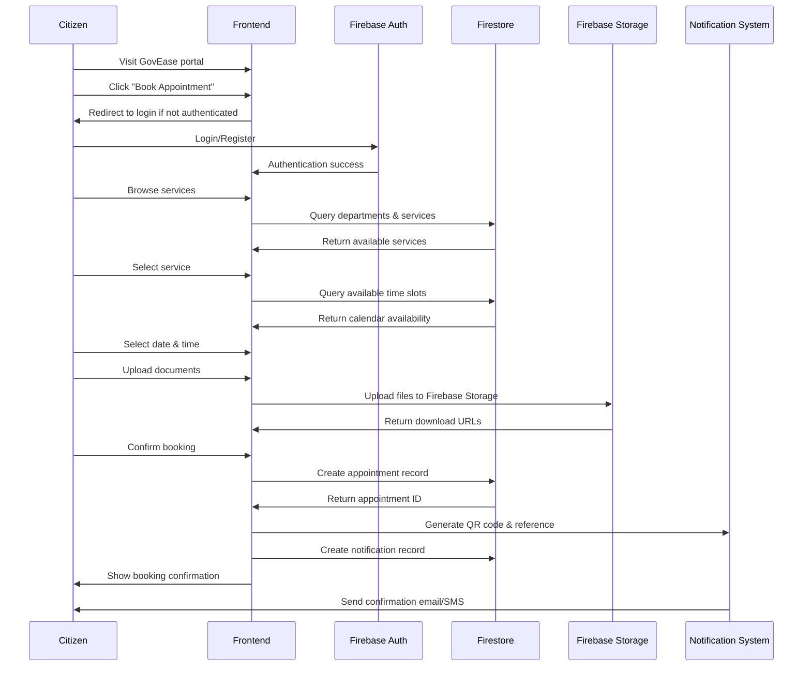
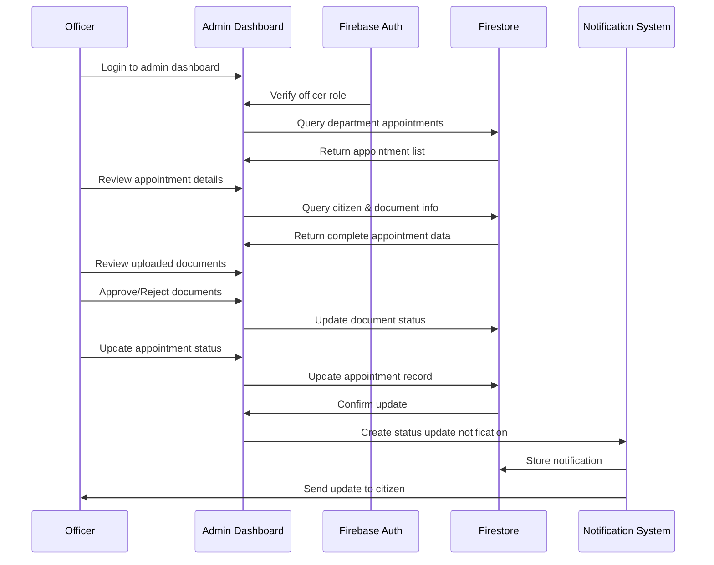
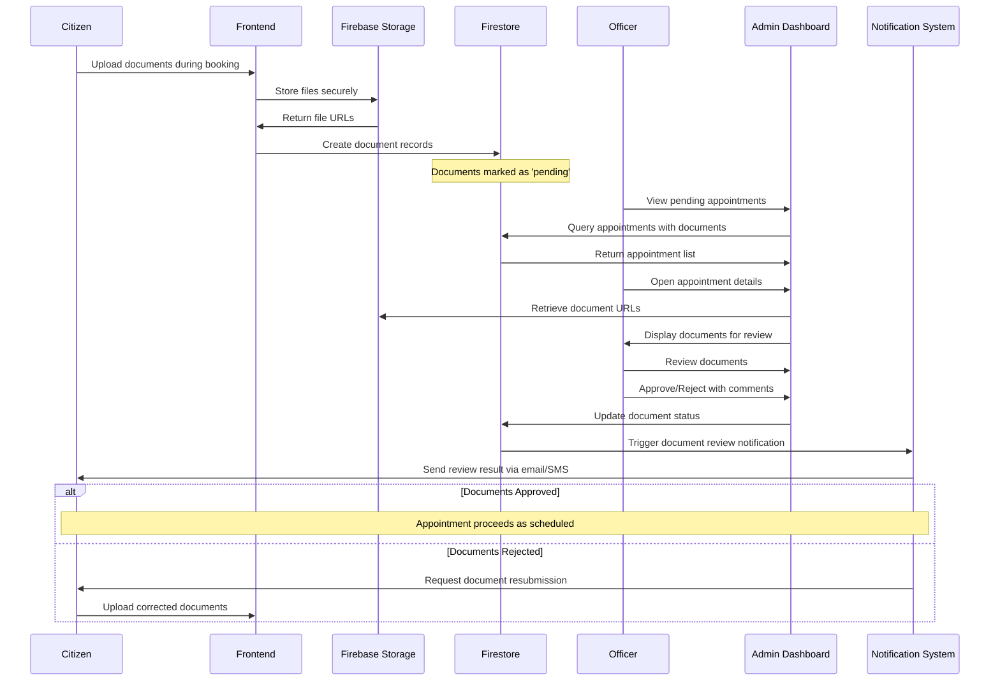
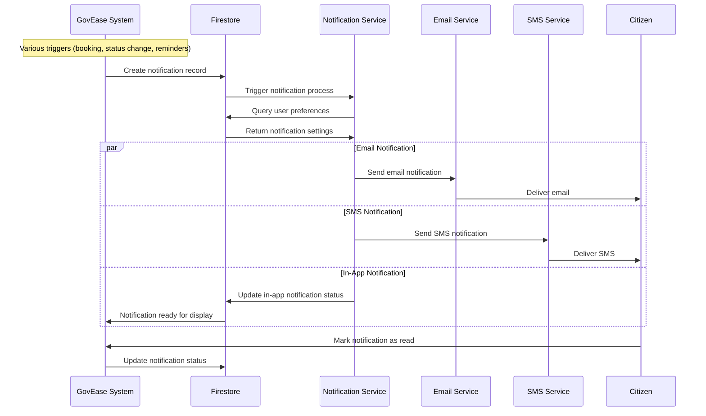
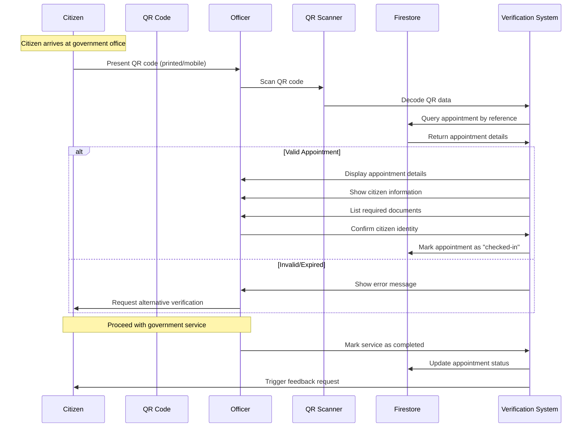
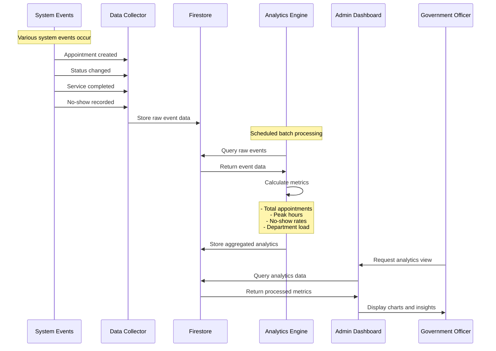
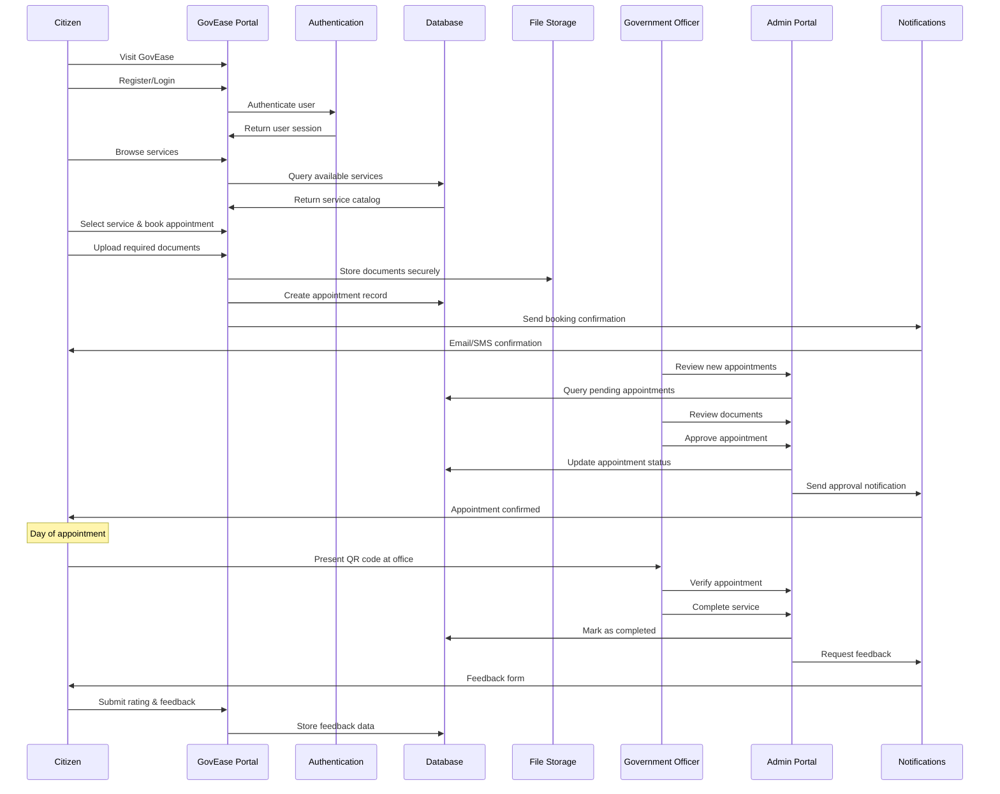

# GovEase Sequence Diagrams

## 1. Citizen Appointment Booking Flow

## 2. Officer Appointment Management Flow

## 3. Document Review Process

## 4. Notification System Flow

## 5. QR Code Verification Flow

## 6. Analytics Data Flow

## 7. Complete User Journey

